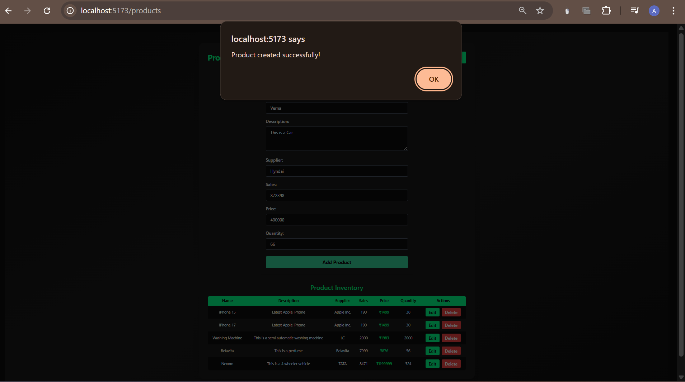
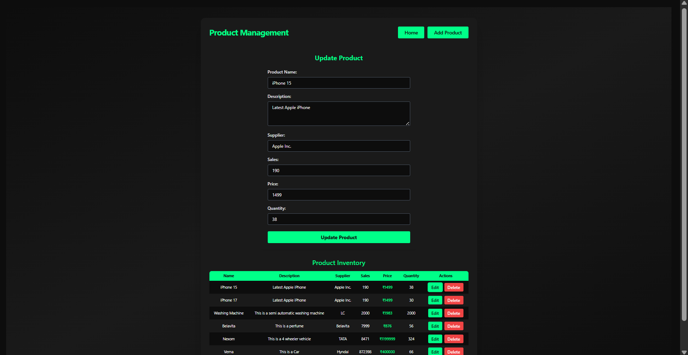
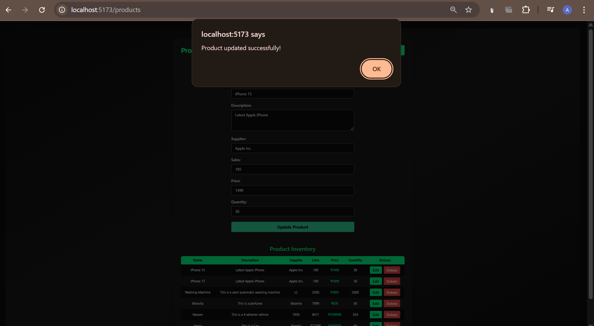
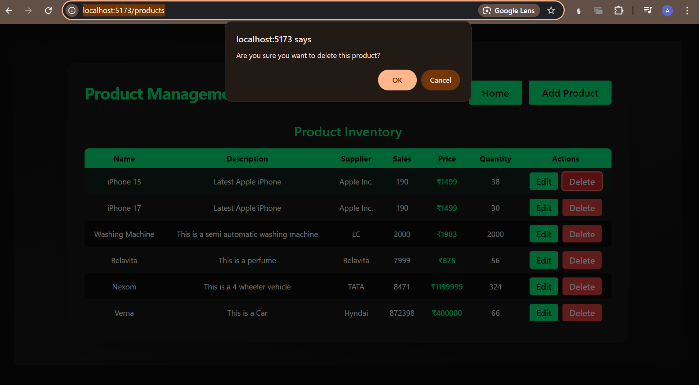
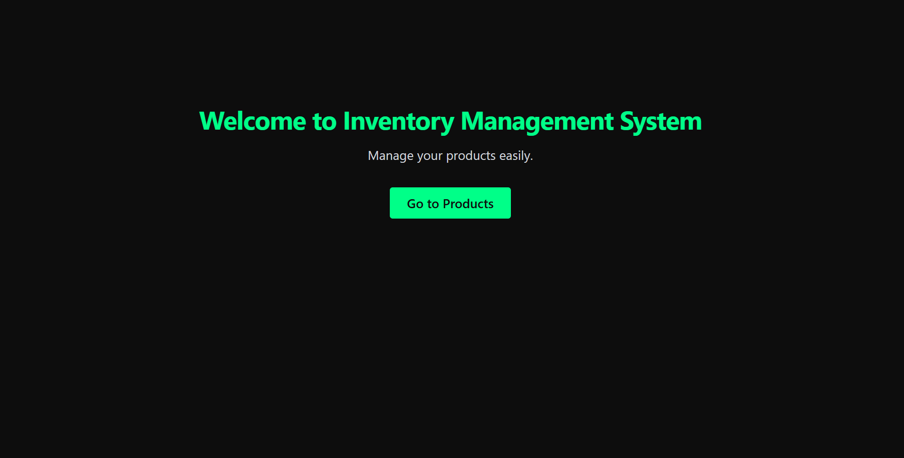

# Inventory Management System

A robust, full-stack Inventory Management System for modern businesses. Built with React, Node.js, Express, MongoDB, and styled with Tailwind CSS for a professional, responsive, and beautiful user experience.

---

## 🚀 Project Overview
The Inventory Management System (IMS) enables users to efficiently manage products and inventory. Users can perform CRUD (Create, Read, Update, Delete) operations on products, track inventory, and view detailed product information. The system is designed for scalability, security, and ease of use, with a clean, business-grade UI.

---

## ✨ Features
- **Product Management:** Add, update, and delete products with attributes like name, description, supplier, sales, price, and quantity.
- **Inventory Listing:** View all products in a searchable, sortable table.
- **Product Details:** View detailed information for each product.
- **Database Connectivity:** Uses MongoDB with Node.js and Mongoose for scalable backend storage.
- **Modern UI:** Professional, dark-themed, responsive design using Tailwind CSS.
- **Confirmation Dialogs:** Prevent accidental deletions.
- **Loading & Error States:** User-friendly feedback for all actions.
- **Extensible:** Easily add features like product search, categories, or analytics.

---

## 🛠️ Tech Stack
- **Frontend:** React (Vite), Tailwind CSS
- **Backend:** Node.js, Express, Mongoose
- **Database:** MongoDB
- **API:** RESTful, JSON
- **Other:** Axios, dotenv

---

## 🏗️ Architecture
```mermaid
graph TD;
  A[React + Tailwind (Client)] -- REST API --> B[Express Server]
  B -- Mongoose ODM --> C[(MongoDB)]
  B -- .env Config --> D[Environment Variables]
```

---

## 📁 Folder Structure
```
Inventory Management System/
├── client/         # React + Tailwind frontend
│   ├── src/
│   │   ├── components/
│   │   ├── pages/
│   │   ├── App.jsx
│   │   ├── main.jsx
│   │   └── ...
│   ├── tailwind.config.js
│   └── ...
├── server/         # Express + MongoDB backend
│   ├── controllers/
│   ├── models/
│   ├── routes/
│   ├── config/
│   ├── index.js
│   └── ...
└── README.md
```

---

## ⚙️ Setup & Installation

### Prerequisites
- Node.js (v16+ recommended)
- npm or yarn
- MongoDB (local or Atlas)

### 1. Clone the repository
```bash
git clone <your-repo-url>
cd Inventory-Management-System
```

### 2. Setup the Server
```bash
cd server
npm install
```

#### Create a `.env` file in `/server`:
```
MONGO_URI=mongodb://localhost:27017/inventory_db
PORT=5000
```

#### Start the server:
```bash
npm start
```

### 3. Setup the Client
```bash
cd ../client
npm install
npm run dev
```

### 4. Open in Browser
Visit [http://localhost:5173](http://localhost:5173)

---

## 📝 Environment Variables
| Variable    | Description                        | Example Value                        |
|-------------|------------------------------------|--------------------------------------|
| MONGO_URI   | MongoDB connection string          | mongodb://localhost:27017/inventory_db |
| PORT        | Server port                        | 5000                                 |

---

## 📜 Scripts
### Server
- `npm start` — Start the Express server
- `npm run dev` — Start server with nodemon (if configured)

### Client
- `npm run dev` — Start Vite dev server
- `npm run build` — Build for production
- `npm run preview` — Preview production build

---

## 📡 API Documentation

### Product Endpoints
- `GET    /api/getallproducts` — List all products
- `GET    /api/products/:id` — Get product by ID
- `POST   /api/products` — Add a new product
- `PUT    /api/updateproducts/:id` — Update a product
- `DELETE /api/deleteproducts/:id` — Delete a product

#### Example Product Object
```json
{
  "_id": "...",
  "name": "Product Name",
  "description": "Description...",
  "supplier": "Supplier Name",
  "sales": 10,
  "price": 99.99,
  "quantity": 100
}
```

---

## 🎨 UI/UX Philosophy
- **Professional:** Clean, modern, and business-oriented
- **Accessible:** High contrast, keyboard navigable
- **Responsive:** Looks great on all devices
- **Feedback:** Clear loading, error, and confirmation states
- **Minimalist:** No clutter, focus on productivity

---

## 🖼️ Screenshots

### Product Management Page


### Add Product Form


### Success Add Product Dialog


### Update Product Form


### Success Update Product Dialog


### Delete Confirmation


### Home Page


> _Screenshots above show the professional, dark-themed UI with accent colors and clear, business-grade layout._

---

## 🛠️ Troubleshooting & FAQ
- **Port already in use?** Change the `PORT` in `.env` or stop the other process.
- **MongoDB connection error?** Check your `MONGO_URI` and ensure MongoDB is running.
- **CORS error?** Make sure client and server ports match and CORS is enabled in Express.
- **Styling not applied?** Ensure Tailwind is installed and imported in `index.css`.
- **API not working?** Check server logs and ensure the backend is running.

---

## 🤝 Contributing
1. Fork the repo
2. Create your feature branch (`git checkout -b feature/YourFeature`)
3. Commit your changes (`git commit -am 'Add some feature'`)
4. Push to the branch (`git push origin feature/YourFeature`)
5. Open a Pull Request

---

## 👥 Credits
- **UI/UX:** [Your Name or Team]
- **Backend:** [Your Name or Team]
- **Inspiration:** Tailwind UI, Heroicons, MongoDB Docs

---

## 📄 License
[MIT](LICENSE) 